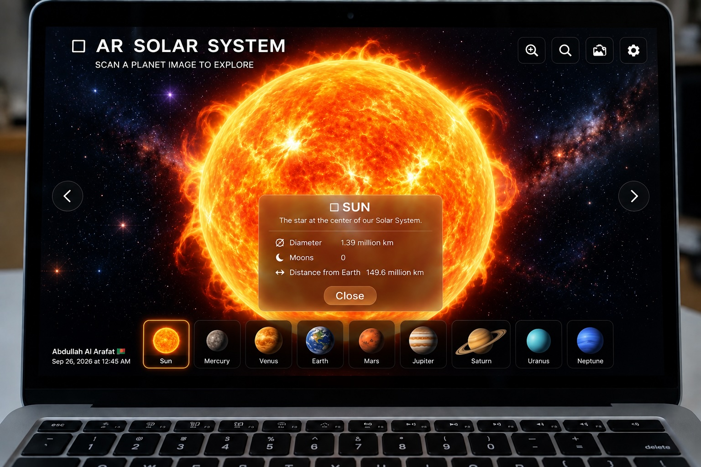

# AR Solar System

An Augmented Reality Solar System application developed using Unity and Vuforia during my industrial training at Battery Low Interactive Ltd.

## Project Preview

## Overview

The AR Solar System project is an interactive Augmented Reality application that visualizes the Solar System in a real-world environment.

Using Vuforia image-target tracking, the application displays a virtual Solar System and allows users to explore different planets through an interactive mobile AR experience.

## Key Features

- Image-target based Augmented Reality
- Interactive Solar System visualization
- Planet selection and exploration
- Planet information panels
- Interactive 3D planetary models
- Zoom and navigation controls
- Real-time AR interaction
- Mobile AR experience

## Technologies

- Unity
- C#
- Vuforia Engine
- Augmented Reality
- 3D Modeling

## Development Experience

Through this project, I gained practical experience in:

- Vuforia image-target configuration
- AR scene development
- 3D object placement
- Interactive UI development
- Planet and Solar System visualization
- Unity scene management
- Mobile AR development

## Demo

[Watch the AR Solar System Demo](Assets/ar-solar-system-demo.mp4)

## Project Context

This project was developed as part of my **AR/VR/XR industrial training at Battery Low Interactive Ltd.**

